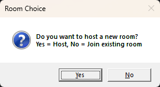

# Talkster — Gaming Chat Overlay

Talkster is a lightweight, minimal gaming chat overlay built on top of [Matrix](https://matrix.org/). It allows gamers to chat in real-time without any backend setup — simply launch the app and start chatting over your games.

---

## Features

- **Zero setup:** Connect directly to Matrix; no server configuration required.
- **Overlay-friendly:** Appears on top of your games without interfering with gameplay.
- **Real-time messaging:** Instant message delivery and reception.
- **Hotkeys for quick access:** Open, hide, and quit the overlay instantly.
- **Room management:** Join existing rooms or host your own effortlessly.

---

## Hotkeys

- `ALT + X` — Open or hide the overlay
- `ESC` — Hide the overlay
- `ALT + Q` — Quit the overlay or restart to rejoin a room

---

## How to Use

1. Launch **Talkster**.
2. Press `ALT + X` to open the chat overlay.
3. Join a Matrix room or create a new one.
4. Chat while gaming and use hotkeys to control the overlay without leaving your game.

---

## Installation

1. Download the latest release from [Releases](#).
2. Extract the files to a desired location.
3. Run `Talkster.exe` (or the appropriate executable for your system).
4. Press `ALT + X` to open the overlay and start chatting.

---

## Screenshots / GIFs

- Overlay visible over a game: shows real-time messages without blocking gameplay.
- Hotkeys in action: quickly hide, open, or quit the overlay.

---

## Requirements

- **Windows** 10 or higher _(Linux/MacOS etc. are **NOT** supported)_
- Matrix account to join existing rooms

---

## License

MIT License — free to use, modify, and distribute.  
